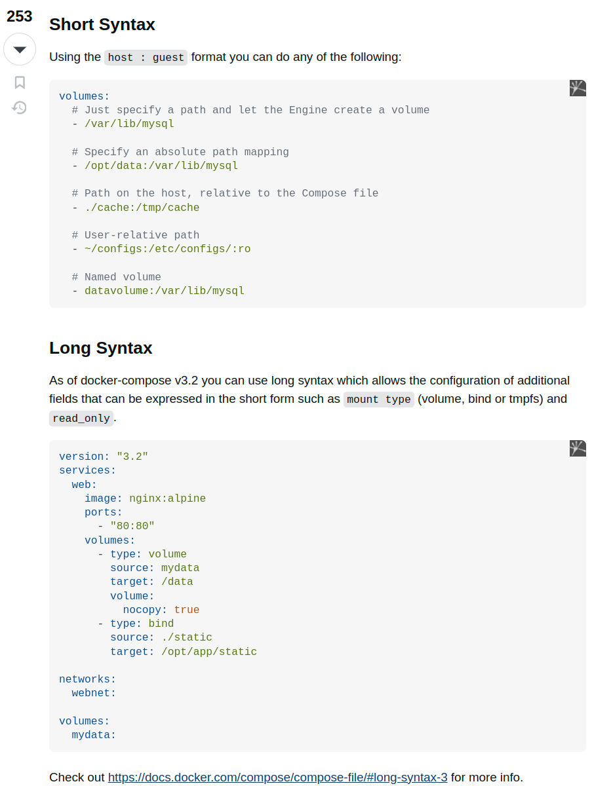

https://stackoverflow.com/a/48442262/14950576

https://kinsta.com/blog/docker-compose-volumes/

This configuration snippet is written in YAML format for use with Docker Compose, a tool for defining and running multi-container Docker applications. Each section of the configuration specifies settings for different aspects of the application environment. Let's break it down section by section for clarity:

### Version

- `version: "3.2"`: This specifies the version of the Docker Compose file format. The version indicates which features and syntax are available for use. Version 3.2 supports features suitable for running in production environments, particularly in swarm mode.

### Services

Under `services`, you define the containers you want to run, their configuration, and their relationships to each other.

- **web**: This is the name of the service, which can be anything you choose. This service configuration tells Docker how to run the container.
  - `image: nginx:alpine`: Specifies the Docker image to use for the service. Here, it's using the `nginx` web server image based on the lightweight `alpine` Linux distribution.
  - `ports`: Maps port 80 on the host to port 80 in the container, allowing web traffic to reach the nginx server.
  - `volumes`: Mounts data from the host into the container. Two types of mounts are defined:
    - A volume mount (`type: volume`) mounts `mydata` (defined under `volumes` at the bottom of the file) to `/data` inside the container. `nocopy: true` indicates that the existing contents of the volume should not be copied to the container's mount point.
    - A bind mount (`type: bind`) mounts the local directory `./static` to `/opt/app/static` inside the container, making the contents of `./static` accessible to the application.

### Networks

- `networks`: Defines networks for the containers.
  - `webnet`: This is a custom network named `webnet`. Defining it under `services` would attach containers to this network, but since it's not explicitly attached under the `web` service, it serves as an unused example here.

### Volumes

- `volumes`: Declares named volumes that can be used by containers.
  - `mydata`: This defines a persistent volume named `mydata`. Containers can use this volume to store data persistently across container restarts and updates.

This configuration sets up a simple web service running Nginx, serving static content from a bound host directory and using a volume for additional data storage, all configured to be easily deployable and scalable with Docker Compose.
